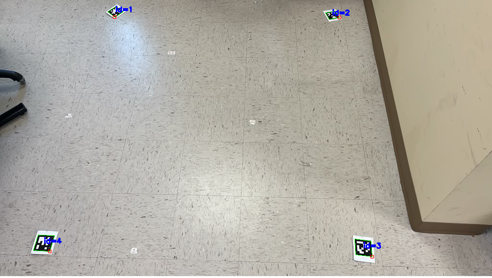

For 2026 VANTAGE, we have moved to [AprilTags](https://april.eecs.umich.edu/media/pdfs/olson2011tags.pdf)  [Fiducial Tags](https://april.eecs.umich.edu/media/pdfs/krogius2019iros.pdf)

| Boundary Markers and Inner panel markers | Distance between markers (using iPhone) |
| :---: | :---: |
|  |  |

|pair|distance|||||||
|-|-|-|-|-|-|-|-|
|1,2|4'7"||1,13|3'8"||1,12|2'2"|
|2,3|5'1"|
|3,4|4'6"|
|4,1|5'2"|

|Detecting the Tags|Clipped tag
| :---: |:---: |
|  | |

