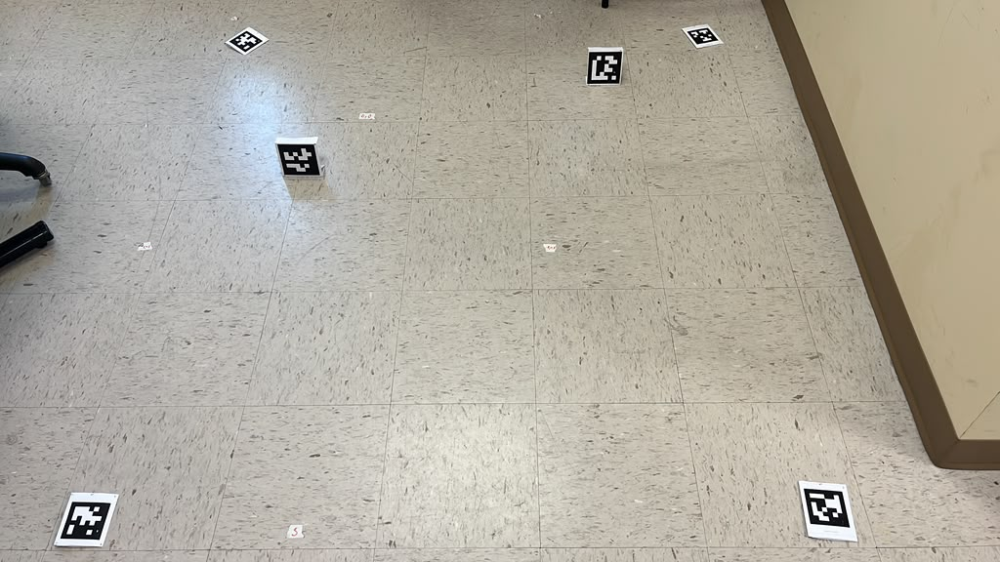
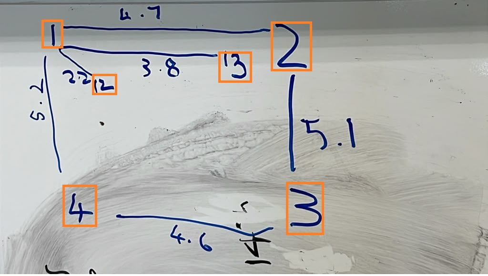
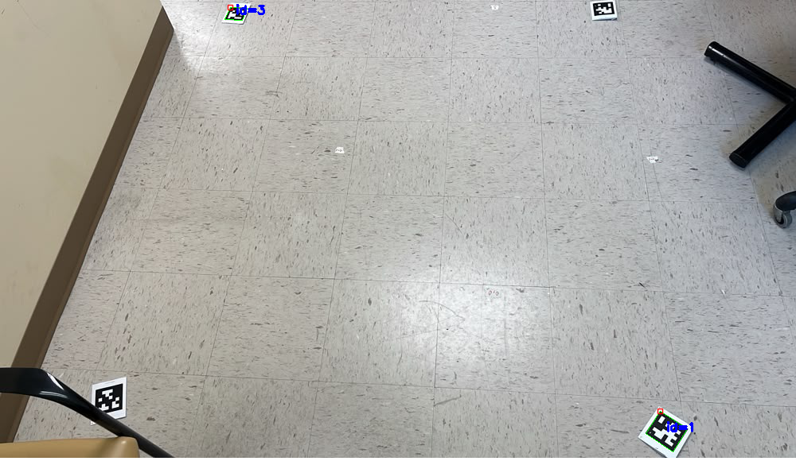
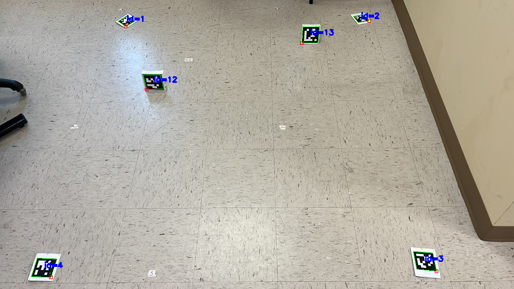

For 2026 VANTAGE, we have moved to [AprilTags](https://april.eecs.umich.edu/media/pdfs/olson2011tags.pdf)  [Fiducial Tags](https://april.eecs.umich.edu/media/pdfs/krogius2019iros.pdf)


| Boundary Markers and Inner panel markers | Distance between markers (using iPhone) |
| :---: | :---: |
|  |  |

|pair|distance|||||||
|-|-|-|-|-|-|-|-|
|1,2|4'7"||1,13|3'8"||1,12|2'2"|
|2,3|5'1"|
|3,4|4'6"|
|4,1|5'2"|

|Detecting the Tags|Clipped tag (not detected 2 and 4)
| :---: |:---: |
|  | |

|Detecting all the Tags|
|:---: |
| |

```
  "boundary_marker_ids": [1, 2, 3, 4],
  "inner_marker_ids": [12, 13]
```

| Inner Marker | Distances to Boundary Markers </p> ` {"ids": [1, 2], "feet": 4, "inches": 7}`|
|---|---|
| 12 | [<ul><li>Marker 1: 1 ft 3.6 in (15.61 in total, 132.7px)</li></ul><br> <ul><li>Marker 2: 4 ft 2.9 in (50.88 in total, 432.7px)</li></ul><br> <ul><li>Marker 3: 6 ft 4.2 in (76.16 in total, 647.8px)</li></ul><br> <ul><li>Marker 4: 4 ft 2.5 in (50.49 in total, 429.4px)</li></ul>] |
| 13 | [<ul><li>Marker 1: 3 ft 7.2 in (43.24 in total, 367.7px)</li></ul><br> <ul><li>Marker 2: 1 ft 0.5 in (12.47 in total, 106.1px)</li></ul><br> <ul><li>Marker 3: 4 ft 11.4 in (59.43 in total, 505.5px)</li></ul><br> <ul><li>Marker 4: 6 ft 10.9 in (82.91 in total, 705.1px)</li></ul>] |
